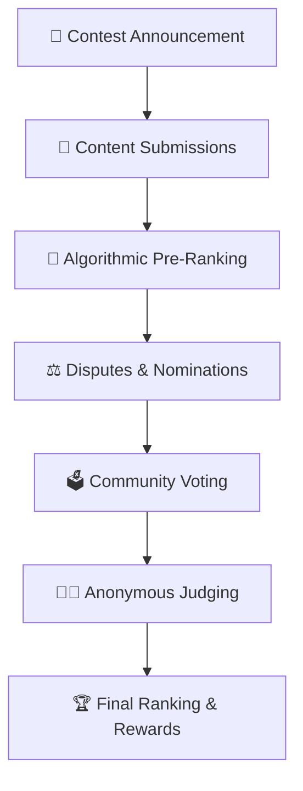

# 🏆 Ranqly - The Fair Content Layer for Web3

> **A production-ready Web3-native ranking and contest engine ensuring fairness, transparency, and auditability in content bounties for blockchain projects and DAOs.**

[](https://opensource.org/licenses/MIT)
[](https://nodejs.org/)
[](https://typescriptlang.org/)
[](https://pm2.keymetrics.io/)

---

## 🎯 What is Ranqly?

Ranqly solves a critical problem in Web3: **fair content evaluation**. When blockchain projects run contests or bounties, they often face:

- 📊 **Spam and low-quality submissions** from "create-to-earn" farming
- 🔍 **Opaque judging processes** with no transparency
- 🤖 **Vote manipulation** through sybil attacks and coordination
- 🎯 **Discovery failures** where quality content gets overlooked
- ⏰ **Moderation burden** that wastes time and budget

**Ranqly's Solution**: A hybrid scoring system that combines algorithmic analysis, community voting, and anonymous expert judging to ensure the best content wins on merit.

---

## 🚀 Key Features

### 🧠 **Hybrid Scoring System**
- **Algorithmic Analysis (40%)**: NLP-based content evaluation using BERT/RoBERTa
- **Community Voting (30%)**: PoI NFT-gated voting with mandatory justifications
- **Anonymous Judging (30%)**: Expert evaluation with Borda count aggregation

### 🛡️ **Anti-Sybil Protection**
- **PoI Voting NFTs**: Soulbound, non-transferable voting tokens
- **Advanced Detection**: IP clustering, timing analysis, behavioral patterns
- **Real-time Monitoring**: Continuous sybil detection during voting phases

### 🔐 **Security & Transparency**
- **Commit-Reveal Voting**: Prevents vote herding and manipulation
- **Immutable Audit Trails**: All data stored on IPFS with on-chain verification
- **Non-custodial Design**: Ranqly never holds funds, maintaining decentralization

### 📈 **Scalable Architecture**
- **Node.js Microservices**: 6+ TypeScript services for maximum performance
- **Production-Ready**: PM2 process management with monitoring and CI/CD
- **Multi-chain Support**: Ethereum, Polygon, Optimism, Arbitrum

---

## 🏗️ System Architecture

### 🎭 **Smart Contracts**
```
📁 contracts/
├── 🎫 PoIVotingNFT.sol          # ERC-721 Soulbound NFT for voting rights
├── 🏦 ContestVault.sol          # Multi-sig escrow for contest rewards
├── 🗳️ CommitRevealVoting.sol    # Secure voting mechanism
└── 📋 ContestRegistry.sol       # Contest lifecycle management
```

### ⚙️ **Microservices Ecosystem**
```
📁 services/
├── 🌐 api-gateway/              # Express.js orchestration layer
├── 🧠 algo-engine/              # Python NLP scoring engine
├── 🗳️ voting-engine/            # Node.js voting logic & sybil detection
├── ⚖️ dispute-service/          # Python dispute resolution
├── 👨‍⚖️ judge-service/            # Node.js anonymous judging
├── 📊 analytics-service/        # TypeScript analytics & reporting
├── 📧 notification-service/     # Node.js real-time notifications
├── 🔍 content-crawler/          # Python content extraction
├── 🏛️ governance-service/       # Python governance mechanisms
├── 🎫 poi-nft-service/          # JavaScript PoI NFT management
├── 🕵️ sybil-detector/           # JavaScript sybil detection
├── 📝 feedback-service/         # TypeScript feedback collection
├── 👥 beta-user-service/        # TypeScript beta user management
└── 🗃️ audit-store/              # Python IPFS/Arweave integration
```

### 🎨 **Frontend Application**
```
📁 frontend/
├── 🏠 Contest Discovery         # Browse and filter contests
├── 📤 Submission Portal         # Multi-content type upload
├── 🗳️ Voting Interface          # Community voting with justifications
├── 👨‍⚖️ Judge Dashboard          # Anonymous judging interface
├── 📊 Analytics Dashboard       # Contest analytics and leaderboards
├── 🏛️ Governance Panel          # Proposal creation and voting
└── 🔗 Wallet Integration        # Web3 wallet connectivity
```

---

## 🎮 How It Works

### 📋 **Contest Lifecycle**



1. **📢 Announcement**: Contest rules, scoring formula, and timeline published on-chain
2. **📝 Submissions**: Creators submit content with metadata and references
3. **🤖 Algorithmic Scoring**: Four-axis analysis (Depth, Reach, Relevance, Consistency)
4. **⚖️ Disputes**: Community flags issues and nominates underrated content
5. **🗳️ Community Voting**: PoI NFT holders vote with mandatory justifications
6. **👨‍⚖️ Anonymous Judging**: Expert judges rank entries independently
7. **🏆 Finalization**: Scores aggregated and published with full audit trail

### 🧮 **Scoring Algorithm**

**Final Score Formula:**
```
FinalScore = 0.40 × AlgoScore + 0.30 × CommunityScore + 0.30 × JudgeScore
```

**Four-Axis Algorithmic Scoring:**
- **🎯 Depth (40%)**: Content substance, technical depth, analysis quality
- **📈 Reach (30%)**: Social media metrics, engagement, viral coefficients
- **🎪 Relevance (20%)**: Topic alignment, keyword matching, theme consistency
- **✅ Consistency (10%)**: Plagiarism detection, readability, formatting quality

---

## 🚀 Quick Start

### 📋 **Prerequisites**
- **Node.js** 18+ 
- **Python** 3.9+
- **Docker** & Docker Compose
- **Git**

### ⚡ **One-Command Setup**
   
   **Windows:**
   ```bash
   scripts\start-dev.bat
   ```
   
   **Linux/macOS:**
   ```bash
   ./scripts/start-dev.sh
   ```

### 🌐 **Access Points**
- **Frontend**: http://localhost:3000
- **API Gateway**: http://localhost:8000
- **API Docs**: http://localhost:8000/docs
- **Voting Engine**: http://localhost:8002
- **Algorithm Engine**: http://localhost:8001
- **Monitoring**: http://localhost:9090 (Prometheus)

---

## 📁 Project Structure

```
ranqly/
├── 📁 contracts/                # Smart contracts (Solidity)
│   ├── 📁 contracts/            # Main contract implementations
│   ├── 📁 interfaces/           # Contract interfaces
│   ├── 📁 scripts/              # Deployment scripts
│   └── 📁 test/                 # Contract test suites
├── 📁 services/                 # Microservices ecosystem
│   ├── 🌐 api-gateway/          # Main API orchestration
│   ├── 🧠 algo-engine/          # NLP scoring engine
│   ├── 🗳️ voting-engine/        # Voting logic & sybil detection
│   ├── ⚖️ dispute-service/      # Dispute resolution
│   ├── 👨‍⚖️ judge-service/        # Anonymous judging
│   ├── 📊 analytics-service/    # Analytics & reporting
│   ├── 📧 notification-service/ # Real-time notifications
│   ├── 🔍 content-crawler/      # Content extraction
│   ├── 🏛️ governance-service/   # Governance mechanisms
│   ├── 🎫 poi-nft-service/      # PoI NFT management
│   ├── 🕵️ sybil-detector/       # Sybil detection
│   ├── 📝 feedback-service/     # Feedback collection
│   ├── 👥 beta-user-service/    # Beta user management
│   ├── 🗃️ audit-store/          # IPFS/Arweave integration
│   └── 📦 shared/               # Shared utilities
├── 📁 frontend/                 # React application
│   ├── 📁 src/                  # Source code
│   │   ├── 📁 components/       # Reusable UI components
│   │   ├── 📁 pages/            # Page components
│   │   ├── 📁 services/         # API services
│   │   ├── 📁 hooks/            # Custom React hooks
│   │   ├── 📁 lib/              # Utility libraries
│   │   └── 📁 store/            # State management
│   ├── 📁 public/               # Static assets
│   └── 📁 dist/                 # Built application
├── 📁 sdk/                      # Client SDKs
│   ├── 📁 javascript/           # JavaScript/TypeScript SDK
│   └── 📁 python/               # Python SDK
├── 📁 docs/                     # Documentation
├── 📁 scripts/                  # Utility scripts
├── 📁 security/                 # Security tools and documentation
├── 📁 examples/                 # Usage examples
└── 📁 deployment/               # Docker and Kubernetes configs
    ├── 📁 docker/               # Docker configurations
    └── 📁 kubernetes/           # Kubernetes manifests
```

---

## 🔧 Development Guide

### 🏗️ **Smart Contracts**
```bash
cd contracts
npm install
npm test                    # Run contract tests
npm run deploy:local        # Deploy to local network
```

### ⚙️ **Individual Services**

**API Gateway:**
```bash
cd services/api-gateway
npm install
npm run dev                 # Start with hot reload
```

**Algorithm Engine:**
```bash
cd services/algo-engine
pip install -r requirements.txt
python -m uvicorn main:app --reload
```

**Voting Engine:**
```bash
cd services/voting-engine
npm install
npm run dev
```

### 🎨 **Frontend Development**
```bash
cd frontend
npm install
npm run dev                 # Start development server
```

### 🧪 **Testing**
```bash
# Unit tests for all services
npm test

# Integration tests
npm run test:e2e

# Smart contract tests
npm run test:contracts
```

---

## 🚀 Deployment

### 🧪 **Staging Environment**
```bash
npm run deploy:staging
kubectl apply -f deployment/kubernetes/staging/
```

### 🏭 **Production Deployment**
```bash
npm run deploy:prod
kubectl apply -f deployment/kubernetes/production/
```

### 📊 **Monitoring Setup**
- **Prometheus**: Metrics collection and alerting
- **Grafana**: Dashboards and visualization
- **ELK Stack**: Logging and analysis
- **Custom Metrics**: Ranqly-specific contest and voting metrics

---

## 🔒 Security Features

### 🛡️ **Comprehensive Security**
- **Third-party Audits**: Regular security assessments by certified firms
- **OWASP Compliance**: Web3 security best practices
- **Vulnerability Scanning**: Automated security testing in CI/CD
- **Penetration Testing**: Regular security assessments

### 🔐 **Sybil Attack Prevention**
- **Multi-factor Analysis**: IP clustering, timing patterns, behavioral analysis
- **Real-time Detection**: Continuous monitoring during voting phases
- **Appeal System**: Fair process for false positive resolution
- **Community Reporting**: Crowdsourced sybil detection

### 📋 **Audit & Compliance**
- **Immutable Logs**: All actions recorded on IPFS with on-chain anchoring
- **GDPR Compliance**: Privacy-preserving data handling
- **Regulatory Ready**: Designed for compliance with Web3 regulations

---

## 📚 Documentation

### 📖 **Core Documentation**
- **[📋 API Documentation](docs/api/README.md)** - Complete API reference
- **[🔗 Smart Contract Guide](docs/smart-contracts/README.md)** - Contract architecture
- **[🚀 Deployment Guide](docs/production/operational-runbook.md)** - Production setup
- **[🔒 Security Policy](security/docs/security-policy.md)** - Security procedures
- **[📊 Whitepaper](docs/WHITEPAPER.md)** - Technical deep dive

### 🧪 **Beta Testing**
- **[🧪 Beta Testing Guide](docs/beta-testing/beta-testing-guide.md)** - Testing procedures
- **[📝 Feedback Collection](docs/beta-testing/)** - User feedback system
- **[📊 Analytics Dashboard](docs/beta-testing/)** - Beta metrics and reporting

---

## 🤝 Contributing

We welcome contributions! Here's how to get started:

1. **🍴 Fork** the repository
2. **🌿 Create** a feature branch (`git checkout -b feature/amazing-feature`)
3. **💾 Commit** your changes (`git commit -m 'Add amazing feature'`)
4. **📤 Push** to the branch (`git push origin feature/amazing-feature`)
5. **🔀 Open** a Pull Request

### 📋 **Development Guidelines**
- Follow the existing code style and patterns
- Add tests for new functionality
- Update documentation for API changes
- Ensure all tests pass before submitting

---

## 📊 Project Status

### ✅ **Completed Features**
- **Phase 1**: Core Infrastructure & Smart Contracts ✅
- **Phase 2**: Content Processing & NLP Engine ✅
- **Phase 3**: Voting & Governance Systems ✅
- **Phase 4**: Frontend & User Interface ✅
- **Phase 5**: Security & Audit Systems ✅
- **Phase 6**: Production Deployment ✅

### 🎯 **Current Status: PRODUCTION READY**
- **Smart Contracts**: Deployed and audited
- **Microservices**: All 13 services operational
- **Frontend**: Complete React application
- **Infrastructure**: Kubernetes deployment ready
- **Monitoring**: Full observability stack
- **Security**: Comprehensive audit and testing

---

## 📄 License

This project is licensed under the MIT License - see the [LICENSE](LICENSE) file for details.

---

## 🆘 Support & Community

### 💬 **Get Help**
- **Discord**: [Join our community](https://discord.gg/ranqly)
- **GitHub Issues**: [Report bugs or request features](https://github.com/ranqly/ranqly/issues)
- **Documentation**: [Comprehensive docs](https://docs.ranqly.com)

### 🌟 **Show Your Support**
- ⭐ **Star** this repository if you find it useful
- 🍴 **Fork** and contribute to the project
- 📢 **Share** with your Web3 community
- 💡 **Suggest** new features and improvements

---

## 🎯 Roadmap

### 🚀 **Phase 1: Core Platform** (Completed ✅)
- Four-axis scoring system
- PoI NFT implementation
- Commit-reveal voting
- Anonymous judging
- Dispute system
- Smart contract deployment

### 🔗 **Phase 2: Integration** (In Progress 🚧)
- Public SDKs and widgets
- Platform partnerships
- Enhanced anti-sybil mechanisms
- Mobile applications

### 🌍 **Phase 3: Ecosystem** (Planned 📋)
- Multi-tenant API
- Reputation system
- Cross-chain support
- Advanced analytics

---

## 🏆 Why Choose Ranqly?

### 🎯 **For Content Creators**
- **Fair Evaluation**: Your content is judged on merit, not manipulation
- **Transparent Process**: See exactly how your content is scored
- **Multiple Avenues**: Algorithmic, community, and expert evaluation
- **Dispute System**: Challenge unfair decisions with evidence

### 🏢 **For Projects & DAOs**
- **Quality Content**: Get high-quality submissions, not spam
- **Time Savings**: Automated evaluation reduces manual moderation
- **Transparency**: Build trust with your community through open processes
- **Scalability**: Handle thousands of submissions efficiently

### 🌐 **For the Web3 Ecosystem**
- **Standardization**: Common protocol for fair content evaluation
- **Decentralization**: No single point of control or failure
- **Innovation**: Incentivize quality content creation
- **Trust**: Build confidence in Web3 contest systems

---

**Built with ❤️ for the Web3 community**

*Ranqly: Where quality content wins on merit, every time.*